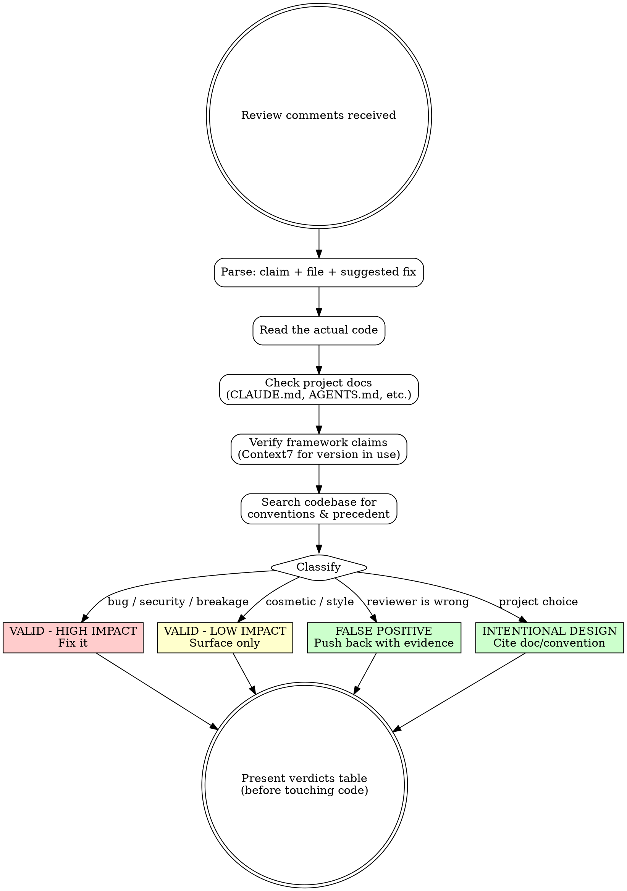

# Process Review Comments

**REQUIRED BACKGROUND:** You MUST understand superpowers:receiving-code-review for behavioral norms: no performative agreement, when to push back, implementation order (blocking → simple → complex), and how to acknowledge correct feedback without gratitude. This skill adds the technical validation layer: reading code, checking project docs, verifying framework claims, and classifying each comment on its merits.

## Overview

You're a technical filter. Not everything a reviewer says is correct. Evaluate each comment against the actual code and project context, not memory, not assumptions, not the reviewer's authority.

**Core principle:** Read before you reason. Verify before you implement. Project context is the ultimate authority.

## Decision Flow



## Step 1: Parse

Extract from each comment: **claim**, **file/location**, **suggested fix**.

## Step 2: Validate (Four Evidence Sources)

Gather evidence from ALL four before forming an opinion:

| Source | What to check |
|---|---|
| **Actual code** | Does the problem exist? Does surrounding context (guards, callers, error boundaries) change the analysis? |
| **Project docs** | CLAUDE.md, AGENTS.md, CONTRIBUTING.md, UI pattern docs. "Gotchas" sections often preempt common review comments. |
| **Framework docs** | Use Context7 (`resolve-library-id` → `query-docs`) for the exact version in use. Recommendations change across versions - a v2 best practice may be a v4 anti-pattern. |
| **Codebase conventions** | Grep for the flagged pattern. If it appears consistently across the project, it's an established convention. Use `git log --follow` to check if the pattern was introduced intentionally. |

**Evidence must come from these sources, never from memory or assumptions.**

## Step 3: Classify

| Verdict | Meaning | Action |
|---|---|---|
| **VALID - HIGH IMPACT** | Bug, security gap, data integrity, a11y violation, broken behavior | Fix directly (high confidence) or present options (uncertain) |
| **VALID - LOW IMPACT** | Cosmetic, stylistic, micro-optimization with no behavioral effect | Surface in table; do NOT implement unless asked |
| **FALSE POSITIVE** | Reviewer is wrong: code is correct as written | Push back with specific evidence |
| **INTENTIONAL DESIGN** | Deliberate project choice, documented or established by convention | Cite the doc section or codebase precedent |

## Step 4: Present Verdicts

Output a table **before touching any code**. Every verdict cites its evidence:

```
| # | Comment | Verdict | Reason |
|---|---|---|---|
| 1 | data?.items is unsafe | FALSE POSITIVE | Guard at L12 ensures data is never null in this code path |
| 2 | Missing soft-delete filter | VALID - HIGH IMPACT | CLAUDE.md §Gotchas confirms BaseModel.is_active; query returns deleted records |
| 3 | Unconventional import order | INTENTIONAL DESIGN | pyproject.toml disables isort; same ordering in 7 sibling files |
| 4 | Variable name unclear | VALID - LOW IMPACT | Accurate observation, cosmetic only |
```

Then state: which you'll fix, which you're skipping, which need confirmation.

## Step 5: Resolve

Implementation order (aligns with receiving-code-review):
1. **Blocking**: build breaks, security issues
2. **Simple**: typos, missing filters, one-line corrections
3. **Complex**: refactoring, logic changes, multi-file edits

Test each fix individually. For uncertain cases (multiple valid approaches, regression risk): describe options and ask.

## Discovering Project Conventions

Don't memorize project-specific patterns; they go stale. Use this methodology each time:

1. **Read project docs first**: "Gotchas" and "Conventions" sections answer common review comments before they're made
2. **Search for precedent**: grep the flagged pattern across the codebase; consistency across many files signals intent
3. **Check git blame**: `git log --follow -p <file>` reveals whether odd-looking code fixes a specific bug
4. **Check tool config**: linter, typechecker, and formatter configs document intentional deviations from defaults
5. **Verify framework claims with Context7**: "recommended way" is version-specific; check actual docs

## Common Reviewer Errors

These categories produce false positives across projects; verify carefully:

- **Optional chaining complaints**: guards, fallbacks, or framework guarantees may make the chain safe
- **"Missing" features**: the feature may be intentionally out of scope (check design docs)
- **Import/style ordering**: many projects disable sorting to manage circular dependencies or grouping
- **Architectural pattern "violations"**: the reviewer may not know the project's chosen patterns
- **"Best practice" without version context**: framework recommendations evolve; verify against the version in use

## Rationalization Guards

When you catch yourself thinking these, STOP: you're rationalizing:

| Rationalization | Reality |
|---|---|
| "The reviewer is probably right" | Probability is not verification. Check the code. |
| "It's a small fix, I'll just do it" | Small fixes accumulate and can introduce regressions. Classify first. |
| "I remember this pattern being wrong" | Memory is stale. Read the actual file. |
| "The reviewer has more context" | You can read the entire codebase. They may not have. |
| "It's safer to just make the change" | Unnecessary changes cause regressions. Push back on false positives. |
| "I don't need to check docs for this" | Project conventions exist for a reason. Check them. |

**Red flags: STOP and return to Step 2:**
- You haven't read the actual file yet
- You're about to agree without citing evidence
- You can't name which doc section supports your verdict
- You're implementing before presenting the verdicts table
